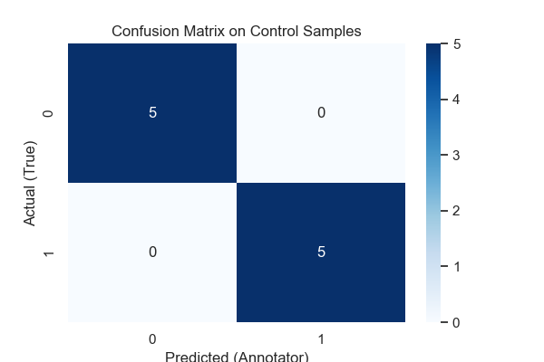

# 📊 Модуль 3: Разметка данных

Преобразует задачу регрессии (предсказание `Ladder score`) в задачу бинарной классификации (`is_happy`) с помощью порога. Готовит данные к разметке, составляет чёткое Техническое Задание (`label_spec.md`). Для контроля качества разметки внедряет заранее известные "контрольные" примеры (`inject_tests.py`). Симулирует процесс разметки аннотатором и оценивает его согласованность с "истинной" меткой на контрольных примерах с метрикой Cohen's Kappa (`scikit-learn`). Формирует финальный датасет с истинной меткой `is_happy` для обучения моделей.

## 🔄 Процесс работы
| Этап                   | 📥 Вход                               | ⚙️ Обработка                                                         | 📤 Выход                                                    |
|------------------------|---------------------------------------|----------------------------------------------------------------------|-------------------------------------------------------------|
| 1. Подготовка к разметке| `../data/clean_[best_strategy].csv` | Загрузка, удаление `Ladder score`, инъекция контрольных строк       | `../data/data_to_label.csv`                                 |
| 2. Разметка (симуляция)| `../data/data_to_label.csv`         | Аннотатор (пользователь) добавляет колонку `is_happy` согласно ТЗ     | `../data/data_labeled.csv`                                  |
| 3. Валидация разметки  | `../data/data_labeled.csv`          | Извлечение контрольных строк, расчет Cohen's Kappa, Confusion Matrix | Метрики качества (Kappa, Accuracy), Визуализация CM         |
| 4. Анализ разметки     | `../data/data_labeled.csv`          | EDA по разметке аннотатора, сравнение с истинной меткой              | Выводы о качестве разметки                                  |
| 5. Финализация         | `../data/clean_[best_strategy].csv` | Генерация 'истинной' метки `is_happy` по порогу `Ladder score`, `df.to_csv` | `../data/final_labeled.csv` (без контрольных строк) |

## ✅ Definition of Done
- [x] Разработано ТЗ (`label_spec.md`) для разметки
- [x] Реализован механизм валидации разметки (здесь: меш-кейс/контрольные примеры + Cohen's Kappa)
- [x] Проанализировано качество полученной разметки (симуляции), сделаны выводы
- [x] Подготовлен финальный размеченный датасет (`final_labeled.csv`)
- [x] Проведена рефлексия по процессу и качеству разметки

## 🔗 Связь с другими модулями
- ⬅️ **Предыдущий**: Модуль 2 (`02_data_cleaning`) передает `../data/clean_[best_strategy].csv`.
- ➡️ **Следующий**: Модуль 4 (`04_active_learning`) получает на вход `../data/final_labeled.csv` для активного обучения.

## Метрики качества разметки (на контрольных примерах)

| Метрика          |
| :--------------- |
| Cohen's Kappa    |
| Кол-во ошибок    |
| Всего контрольных|
| % ошибок         |

*(Значения доступны после запуска `label_tool.ipynb` с файлом `data_labeled.csv`)*

## Решение для следующих модулей

В Модуле 4 (Активное обучение) будет использоваться **финальный датасет `../data/final_labeled.csv`** с колонкой `is_happy` (сгенерированной по правилу `Ladder score >= 6.0`) в качестве целевой переменной. 