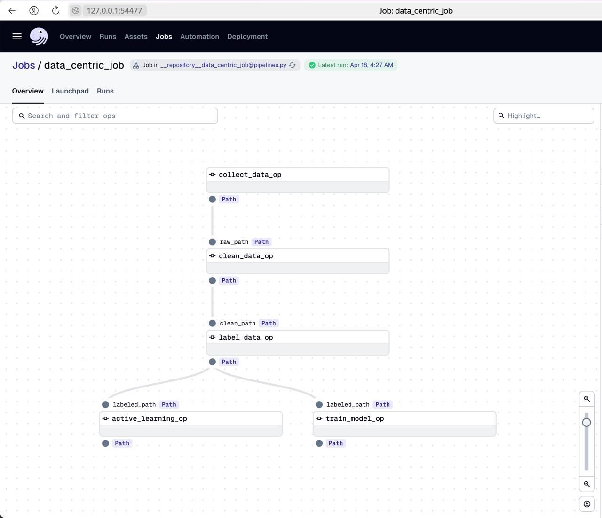
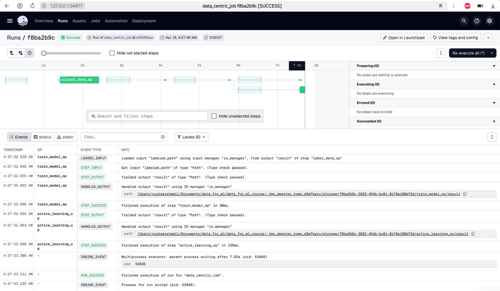
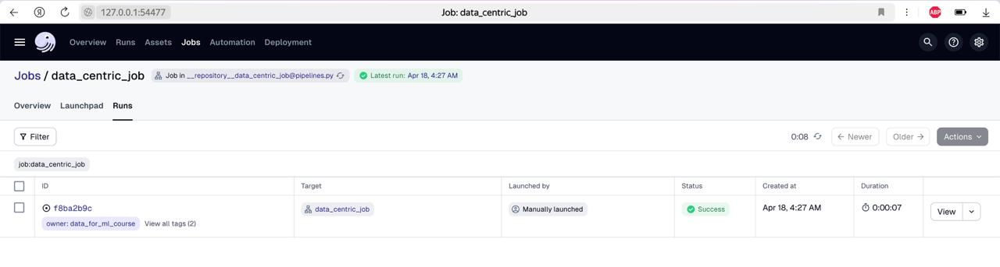

# Data-Centric ML Course Project

[](https://github.com/<YOUR_GITHUB_USERNAME>/data_for_ml_course/actions/workflows/ci.yml)

This repository contains the project for the Data-Centric ML course.

## Table of Contents

- [Module 1: Data Collection](./01_data_collection/)
- [Module 2: Data Cleaning](./02_data_cleaning/)
- [Module 3: Data Labeling](./03_data_labeling/)
- [Module 4: Active Learning](./04_active_learning/)
- [Module 5: Dagster Pipeline](./05_final_dagster_pipeline/)

## Pipeline Results

Dagster pipeline has been successfully implemented and executed! The pipeline consists of 5 key operations that process data from collection to model training:

1. `collect_data_op`: Fetches data from World Happiness Report and Gapminder GDP
2. `clean_data_op`: Cleans and prepares the data
3. `label_data_op`: Generates labels for the classification task
4. `active_learning_op`: Applies active learning to optimize the dataset
5. `train_model_op`: Trains the final model

### Pipeline Visualization



### Execution Results

The pipeline was successfully executed with all operations completing without errors:





## Quick Start

1. Clone the repository:
   ```bash
   git clone https://github.com/<GITHUB_USERNAME>/data_for_ml_course.git
   cd data_for_ml_course
   ```
2. Create a virtual environment and install dependencies:
   ```bash
   python3 -m venv venv
   source venv/bin/activate
   pip install -r requirements.txt
   ```
3. Run the Dagster pipeline (after completing Module 5):
   ```bash
   dagster dev
   ``` 

